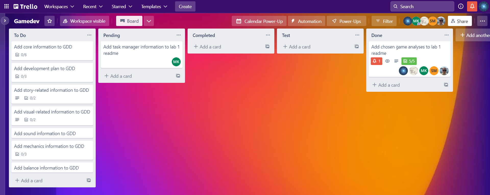

# Team and project
## Team code/name
> Team code: Г2.

## Team members list
1. > Хоменко М.О. - **team leader**
2. > Яценко М.О.
3. > Новак А.В.
4. > Марченко С.В.
5. > Коломійчук А.К.

## Unity version
> 2021.3.11f1

# Lab
## About team task management (screenshot/description)

*To Do*: список запланованих features.  
*Pending*: список features, які розробляються.  
*Completed*: список features, які є розробленими, але ще не тестованими.  
*Test*: список features, які знаходяться в тестуванні.  
*Done*: список features, які є завершеними.  

## Chosen games analysis
### Omori
*Учасник команди:* Новак А.В.

Жанр: RPG, пригодницька гра, інді.

Стиль графіки: піксель-арт в RPG-складовій та мальована графіка у важливих кат-сценах, а також у меню інвентарю і в боях.

Гравець бере на себе роль Оморі - підлітка у стані депресії, що більшу частину часу проводить в уявному світі, разом з уявними версіями своїх друзів із дитинства. Головною метою є знаходження зниклого п'ятого друга - Безіла. Залежно від зроблених гравцем виборів, можлива також розширена сюжетна лінія справжнього світу, де головний герой відновлює зв'язок зі згаданими друзями перед переїздом. Гра має декілька кінцівок.

Елементи геймплею можна розділити між двома основними режимами - дослідженням світу та бойовим режимом.
#### Дослідження світу
Гравець може подорожувати яскравим і сюрреалістичним Головним простором (Headspace) або справжнім світом, залежно від стадії гри. Механічно Головний простір та справжній світ подібні.

Основні елементи:
- Взаємодія з елементами світу. Наприклад, кавунами, які дають випадкові предмети. Особливий випадок - кошики для пікніка, що дозволяють зберегти прогрес.
- NPC, які можуть давати квести. Як валюту гравець може заробляти й витрачати під час торгівлі з NPC раковини або долари, у Головному просторі та справжньому світі відповідно.
- Перемикання між 4 персонажами, щоб отримати доступ до особливостей кожного з них та розв'язати специфічні задачі у світі.
- Взаємодія з ворогами: вороги рухаються навколо певних ділянок випадковим чином, фізичне зіткнення з ними переводить у бойовий режим. Вороги можуть переслідувати гравця.
#### Бойовий режим
Яскравіше виражений у Головному просторі, оскільки не всі його частини тематично підходять до справжнього світу.

Основні елементи:
- Здоров'я (Heart), нестача якого перетворює персонажа на "тост", та сік (Juice), що є аналогом мани в більш традиційних RPG іграх.
- Емоції. І для героїв, і для ворогів існують три основних емоційних стани - Щасливий, Сумний та Роздратований, - що викликаються різними подіями, наприклад, здібностями. Вплив станів на нанесені/отримані пошкодження збалансований за принципом "камінь-ножиці-папір": Щасливий < Сумний < Роздратований < Щасливий (емоція зліва від < слабка проти правої). Крім цього, кожна емоція має специфічні переваги та недоліки.
- Обладнання: кожному персонажу можна змінювати обереги та зброю. Виняток: Оморі завжди користується ножем. Обладнання впливає на основні показники, такі як здоров'я, сік, пошкодження, захист і т.д.
- Спеціальні дії, такі як використання здібностей, їжі й іграшок. Їжа дає позитивні ефекти членам команди, ефекти від іграшок - більш різноманітні та спеціалізовані, наприклад, зміна емоційного стану. Здібності є унікальними для кожного героя, потребують очок соку для застосування та розблоковуються в міру підвищення рівня персонажа або виконання деяких квестів.
- Рівні героїв, для підвищення яких потрібний досвід. Під час перемоги його отримують усі герої, що не є "тостом".
- Командна робота - набір потужних додаткових дій, що персонажі можуть виконати після звичайної атаки. Кожен персонаж по-різному взаємодіє з іншими трьома. Застосування командної роботи потребує спеціальної енергії, що накопичується, коли будь-який із героїв зазнає пошкоджень.

### Cyberpunk 2077
*Учасник команди:* Хоменко М.О.

Жанр: open-world action RPG.

Стиль графіки: реалістичний; користувацький інтерфейс заточений під стиль кіберпанку.

Події гри розгортаються у вигаданому місті Найт-Сіті, Каліфорнія, надаючи відкритий світ з шістьма різними регіонами. Головним персонажем є найманець Ві (V), зовнішність і стать якого налаштовуються гравцем за бажанням. На одному із завдань, Ві має викрасти новий чіп мегакорпорації Арасака (Arasaka), створений для перенесення свідомості. Однак під час нього, Ві мимовльно стає свідком убивства глави Арасака, і за вбивство звинувачують саме Ві. Найманця застрелюють але не насмерть. Тепер, знаючи, що, завдяки чіпу, часу обмаль і смерть неминуча, Ві починає шукати спосіб позбутися побічних ефектів від носіння чіпа і врятувати своє життя. У залежності від вибору гравця наприкінці гри, доступні шість цінківок (існує сьома, але вона відрізняється несуттєво).

#### Геймплей

Гра переважно відбувається від першої особи. При створенні персонажа, гравець має можливість задати значення п'яти різним характеристикам, які змінюють ігровий процес:
- Сила (здатність носити важкі предмети, ефективність близького бою);
- Рефлекси (ефективність стрільби та володіння холодною зброєю);
- Технічні здібності (технічна обізнаність, рівень вправності з високотехнологічною зброєю);
- Інтелект (злам і програмування);
- Холоднокровність (прихованість).

Також на початку дається можливість обрати походження Ві. Серед них є:
- Nomad (кочівник з пустелі)
- Streetkid (гангстер, який виріс на вулицях Найт Сіті)
- Corpo (колишній працівник Арасака)

Різні походження відкривають нові шляхи проходження місій, і впливають на діалог.

Гра має плавну систему класів, тобто гравець не замикається в конкретну роль і, упродовж гри, має абсолютну свободу обирати саме ті навички, які найкраще підходять його стилю гри. Ві може в основному відповідати трьом гілкам навичок:
- Netrunner (хакер, який надає перевагу прихованості й рідко використовує вогнепальну / холодну зброю);
- Techie (інженери, здатні створювати різні види зброї);
- Solo (фокус на бойових діях, конкретно на ближній бій).

Зброя доступна як холодна, так і вогнепальна. Серед холодної є як і стандартні ножі, бити, молоти й тесаки, так і особлива зброя у вигляді кібернетичних імплантантів (Mantis Blades / Monowire / Gorilla Arms). Вогнепальна зброя поділяється на стандартну, технічну (дозволяє прострелити перепони), та "розумну" (самонавідна). Є чотири типи ушкоджень: фізичне, теплове, електромагнітне та токсичне.

#### Світ

Найт-Сіті, де відбуваються події гри, розбито на шість регіонів: міський Центр, Вотсон, Вестбрук, Гейвуд, Пасифіка й Санто-Домінго. За межами міста доступна пустеля, заселена подорожуючими таборами найманців. У місті динамічно змінюється час доби й погода. У деяких локаціях доступні міні-ігри — гонки, хакерство, ігрові автомати, і змагання в рукопашному бою чи в стрільбі. Подорожувати можна як і пішки, так і на транспорті — авто, мотоцикли — і також присутня функція швидкої подорожі, яка дозволяє миттєво перенестися до іншої точки на карті. Під час подорожей у транспорті доступне місцеве радіо.

Від різних персонажів — "фіксерів" — Ві може отримати завдання, за виконання яких отримає гроші, досвід, і репутацію. Гроші дозволяють придбати не тільки нові кібернетичні удосконалення й зброю, а ще й нові авто та квартири. Досвід підвищує рівень гравця, і новий рівень дозволяє як покращити один із п'яти атрибутів, так і відкрити нову здібність. Навички можна покращити далі, знайшовши відповідний чіп або часто використовуючи відповідні здібності. Репутація відкриває важчі місії й краще обладнання в магазинах. Максимальні рівні досвіду та репутації, які можна здобути, — 50.

### Fallout 4
*Учасник команди:* Коломійчук А.К.

Жанр: Open World, Action RPG

Стилістика: постапокаліпсис, ретро-футуризм

Гравець бере на себе роль єдиного вижившого сховища 111, який шукає свого сина у світі, зруйнованому ядерною війною.
В основі геймплею - подорож світом, боротьба з ворогами, проходження сюжету.
#### Основні особливості
##### Відкритий світ 
Не враховуючи початкової гілки сюжету із навчальними елементами, гравець має повну свободу вибору і може вільно подорожувати світом із сотнями локацій та квестів. Ключовим елементом сюжету є вибір однієї із фракцій (Підземка або залізниця, Мінітмени, Інститут, Братство Сталі), кожна з яких має свою ідеологію, унікальні ігрові предмети, персонажів та квести.
##### Система S.P.E.C.I.A.L. 
Персонаж гравця має 7 характеристик: сила, сприйняття, витривалість, харизма, інтелект, спритність та удача. З кожним підвищенням рівня гравець може збільшити один з показників характеристик або покращити рівень навички. Можливість відкривати навички залежить від відповідного рівня показника характеристик. В результаті гравець має обирати не лише необхідні йому навички, але й обирати певну гілку характеристики з відповідними навичками; набір навичок напряму впливає на певні аспекти гри (напр. доступні репліки діалогів) й, відповідно, можливості гравця та стиль гри.
##### Система V.A.T.S. 
Оскільки в основі грі - подорож світом, ключовим елементом геймплею є бій з ворогами. VATS дозволяє гравцю перенести акцент бойової системи з класичної стрільби у тактичну площину: замість прицілювання гравець може витрачати очки витривалості аби поцілювати у певні частини тіла ворога із певним шансом. Це зменшує поріг входження, оскільки немає необхідності вміти влучно стріляти.
##### Створення власного поселення.
Напевно, найбільш неоднозначною "фішкою" гри є можливість створити своє поселення (систему поселень) та розвивати його. Хоча це й має сюжетне обгрунтування, менеджмент поселень не є обов'язковим та практично не впливає на гру.
##### Економіка
У грі присутня розвинена система крафту та ресурсів. Впродовж усієї гри потрібно збирати мотлох, перероблювати його на матеріали, покращувати свою зброю та обладунки, торгувати, слідкувати за своїми запасами патронів та медикаментів. Присутня лише одна валюта - кришки, що значно полегшує торгівельно-економічну складову гри.

### Solomon`s Keep
*Учасник команди:* Марченко С.В.

Жанр: Action RPG.

Гравець бере на себе роль випускника Чарівного коледжу, останнім іспитом якого є штурм Соломонової фортеці, глибоко всередині якої сидить Темний Соломон, а охороняють його різні скелети, зомбі та монстри.

#### Основні особливості:
#### Pежими гри:
Перед початком гри гравець обирає режим гри: звичайний (у разі смерті можливе відновлення) або ускладнений (у разі смерті гра закінчується) – та одного з 4-х чарівників – головних персонажів гри. Чарівники відрізняються лише зовнішнім виглядом.

#### Світ:
На початку гри герой потрапляє на площу міста, де може поспілкуватися з вчителями-чарівниками та дізнатися більше про екзамен, Темного Соломона, певні поради щодо покращення навичок та інші особливості процесу гри. З другим викладачем можна покращити свої навички боротьби та обміняти золото на досвід. Третій вчитель виконує роль магазину.
Основним місцем в грі є чарівна вежа. Після проходженням кожного рівня герой підіймається по її ярусах. Планування рівнів вежі генерується випадковим чином, тобто абсолютне повторення сюжету вкрай малоймовірне. 

#### Види озброєння:
Перед переходом до основного місця подій головний герой має обрати собі основну зброю: чарівну ракету, вогняну кулю, блискавку або морозний струмінь. Під кожним з них написано їх ефективність та витрату боєздатності. Після проходження кожного рівня є можливість отримати додаткову навичку або додатковий вид озброєння. Наприклад, магічний щит, магічну кулю, морозний струмінь, деактивувати певний вид ворогів на певний час, повернути собі здоров’я та бойову шкалу та інше. 
Загалом у грі 21 навичка та 50 видів різного озброєння.

#### Ігровий процес
На кожному з рівнів гравцю необхідно битися з різними персонажами. На початкових рівнях це будуть звичайні склелети, які не мають особливих навичок, але завдяки своїй кількості все одно можуть вбити головного героя. Вже далі необхідно боротися з зомбі, покращеними скелетами (додаткова зброя та броня) та драконом. На останніх рівнях кімнати можуть закриватися, тобто головний герой не зможе втекти від ворогів.                   
У кожній кімнаті знаходять скрині з золотом, які необхідно розбивати, щоб отримати більше монет. У них також можуть бути заховані магічні атрибути.        
Гравець має ключ, який активує телепорт. За його допомогою можна повернутися на головну площу нескінченну кількість разів, щоб докупити собі певні елементи або поспілкуватися з вчителями.                        
На шкалах зверху користувач може бачити рівень здоров’я та боєздатності. З кожною атакою рівень боєздатність зменшується. Якщо рівенеь боєздатності критично впав, то герой не може атакувати. Боєздатність та здоров'я відновлюються з плином часу.

### Genshin Impact

Учасник команди: Яценко М.О.

Жанр: open-world action RPG.

Стиль графіки: 3D графіка у стилі аніме.

Події розгортаються у фентезійному світі під назвою Тейват. Гравець на вибір бере на себе роль одного з близнюків, які потрапили в нього, але були розділені невідомим богом. На щастя, вже скоро головний герой знаходить невелику літаючу істоту на ім’я Паймон, яка стає його радницею і допомагає знайти союзників. Керуючи командою з чотирьох персонажів гравець подорожує, досліджує світ, вирішує головоломки і збирає ресурси, по черзі шукаючи кожного з семи Богів (Архонтів) цього світу, аби дізнатися, що сталося з його родичем. 

#### Основні особливості

##### Стихії
В Тейваті зустрічаються люди, що мають так зване око Бога – дар від певного Архонта, що дозволяє їм керувати одною з семи стихій (Анемо, Кріо, Піро, Дендро, Гідро, Гео або Електро). Кожна пара стихій взаємодіє між собою унікально, викликаючи деякий еффект – наприклад, взаємодія Піро (вогонь) та Дендро (рослини) призведе до реакції горіння. Саме на взаємодії стихій одна з одною побудована основна механіка гри. Кожен з придатних для гри персонажів володіє певною стихією – лише від гравця залежить, як він буде комбінувати їх у команді та використовувати на свою користь.

•	Битви – найчастіше всього стихії доведеться використовувати саме тут. Для успішного ведення битв гравцю доведеться розібратись, яка стихія є найбільш ефективною проти стихії його супротивника, які елементальні реакції можна викликати, щоб нанести супротивнику більше урону, і т.д. Окрім стихійних атак персонажі можуть атакувати фізично, за допомогою обраної зброї. Всього існує 5 класів зброї: лук, меч, двуручний меч, каталізатор і спис.

•	Головоломки – більшість паззлів у грі побудовані на елементальній взаємодії. Інколи гравцю, аби перетнути ріку, доведеться використати магію Кріо-персонажа, щоб заморозити воду. Або, щоб не замерзнути насмерть на засніженній горі, потрібен персонаж Піро, який зможе розпалювати багаття. 

##### Переміщення світом
Основний ігровий процес відбувається на одній відкритій карті, яка містить у собі всі регіони Тейвату, кожен з яких відведений під певну стихію, та по якій можно вільно подорожувати. Винятком є підземелля, в яких відбуваються деякі сюжетні або регулярні квести. Переміщуватися можна пішки, але через величезний розмір карти це не завжди зручно, у зв’язку з чим існує телепортація – в гравця є допоміжна мапа, на який відмічен увесь Тейват. Регіон є прихованим на мапі до того моменту, поки гравець пішки не дійде до нього і не активує статую Архонта в цьому регіоні. Після цього гравець може телепортуватися в цю точку, використовуючи мапу, з будь-якого кутку карти. Аналогічно зі статуями Архонтів функціонують звичайні точки телепортації, розкидані по світу.

##### Підвищення рівню
•	Рівень персонажа – окремий в кожного персонажа, підвищується завдяки використанню книг та ресурсів світу, що можна знайти в скринях, виграти в сутичках або купити. Чим вищий рівень, тим сильніший персонаж і більше нових таланів в нього відкривається. Ефективність персонажа можна збільшувати, вдосконалюючи його зброю та артефакти.

•	Ранг пригод – рівень аккаунту, що встановлює наскільки гравцю відкривається сюжет, діючі події, складність ворогів та підземель. Багато квестів відкривається лише з 
високго рангу пригод. Підвищувати його можна проходженням квестів, перемогою над босами тощо.

##### Фінансова система
Мора – одна з основних ігрових валют, аналог монет. Використовується вона для підвищення рівня персонажів або купівлі ігрових предметів.
Камінь Витоку — спеціальна рідкісна валюта, що використовується для молитв.
Камні витоку отримати не так легко, проте можливо - виконуючи сюжетні або щоденні завдання, вбиваючи сильних босів, відкриваючи нові місця телепортації та здобуваючи досягнення.

##### Набір команди
Під час переміщення або бою гравець може перемикатися між чотирма персонажами, з яких складена його команда. Склад команди можна змінювати в головному меню у вільний від битв та квестів час. Деякі персонажі автоматично надаються гравцю під час проходження сюжету, а решту отримують за «молитви», які по своїй суті являють гача-механіку: гравець віддає деяку кількість каменів витоку і отримує випадковий приз – зброю або персонажа. Шанс випадіння легендарного персонажа дуже малий, але гарантований після значної кількості молитв.

##### Додаткові механіки
Гра дуже цікава великою кількістю додаткових механік: приготування страв, алхімія, ковальство, рибальство, створення свого будинку. Всі вони тим чи іншим чином полегшать проходження сюжету.
